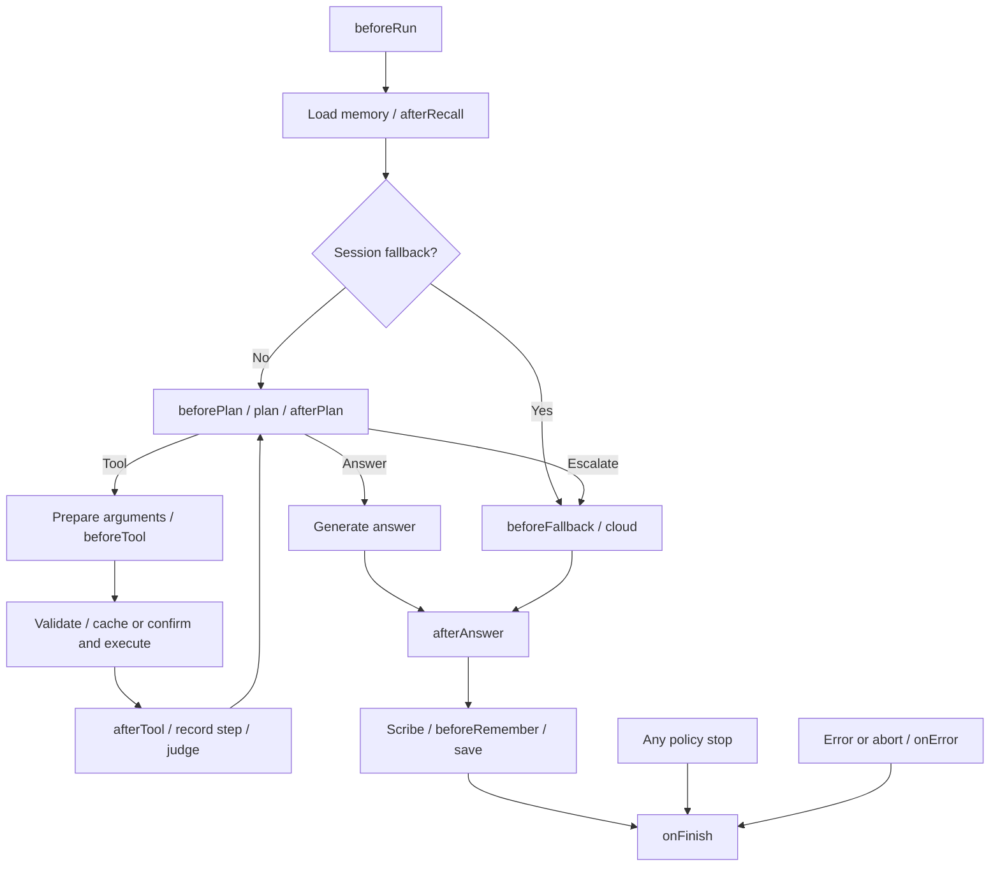

# Configurable lifecycle extensions

Research and original API proposal, 2026-09-05. Local baseline: `7e81eec`.
The first implementation now ships with Goliath; see the [extension API](../extensions.md) for the
actual contract. The baseline analysis and proposed delivery sequence below document the design
that preceded it.

Goliath should accept an ordered `extensions` array of named TypeScript objects with optional
lifecycle methods. An extension can customize several phases together: load application context,
restrict tool use, redact results, control cloud handoff, and shape what gets remembered. Keep
`onEvent` for observation and return explicit values from hooks that change behavior.

This fits the existing small, on-device loop: registration itself adds no model calls, prompt
tokens, or runtime dependencies. Extensions that inject text still consume the context budget.

## What is configurable today

| Existing API                        | Current capability                                              | Remaining gap                                                                       |
| ----------------------------------- | --------------------------------------------------------------- | ----------------------------------------------------------------------------------- |
| `instructions`, `facts`, `examples` | Supply prompt context; facts can be computed once per turn      | No asynchronous per-run context preparation or per-step changes                     |
| `tools`, `toModelOutput`            | Supply tool implementations and format their successful results | No shared policy or transformation across tools                                     |
| `confirm`                           | Approve or decline writes, with a reason                        | No general gate for reads, cache access, or cloud handoff                           |
| `memory`                            | Replace storage through `load` and `save`                       | No explicit separation between transient recall edits and durable memory edits      |
| `fallback`                          | Replace cloud execution                                         | No independent policy/redaction chain before handoff                                |
| `onEvent`                           | Observe trace events synchronously                              | No awaited lifecycle decisions or transformations                                   |
| `compressors`                       | Declared in `GoliathConfig`                                     | Currently unused: `createAgent` does not forward it and the loop does not invoke it |

These findings come from [configuration](../../src/types.ts),
[construction](../../src/create-agent.ts), [the turn loop](../../src/run-turn.ts),
and [the worker](../../src/worker.ts).

## What the six frameworks contribute

| Framework                    | Extension mechanism and evidence                                                                                                                                                                                                                                                                                                                                                                                                                                                                                                                                                                                               | What Goliath should take from it                                                                          |
| ---------------------------- | ------------------------------------------------------------------------------------------------------------------------------------------------------------------------------------------------------------------------------------------------------------------------------------------------------------------------------------------------------------------------------------------------------------------------------------------------------------------------------------------------------------------------------------------------------------------------------------------------------------------------------ | --------------------------------------------------------------------------------------------------------- |
| Claude Code                  | Event → matcher → handler configuration covers sessions, prompts, tools, permissions, stopping, and compaction. Pre-tool handlers can gate or rewrite input. Matching handlers run concurrently; competing input rewrites can depend on completion order. [Official hooks](https://code.claude.com/docs/en/hooks), [ordering limitations](https://code.claude.com/docs/en/hooks-guide#limitations)                                                                                                                                                                                                                             | Clear named phases and explicit decisions, with deterministic transformation ordering                     |
| Grok Bot 0.18 reconstruction | A versioned config declares 21 phases and per-handler matchers, timeouts, loop limits, and `failClosed`. Its remote runtime runs pre-hook → tool → success/failure hook. `ask` is accepted by a response schema but rejected as unimplemented in that runtime. [Config validation](https://github.com/dhanlon-intellica/grok-bot-0.18-reconstructed/blob/a9f633e09d49a85829b8236331b9e21f7e612634/source/packages/hooks/validators/hooksConfig.ts), [runtime](https://github.com/dhanlon-intellica/grok-bot-0.18-reconstructed/blob/a9f633e09d49a85829b8236331b9e21f7e612634/source/packages/agent/tools/core/remote-hooks.ts) | Validate both configuration and runtime behavior; specify error semantics for every decision hook         |
| Mastra                       | Named processors cover input, individual model steps, provider requests/responses, successful tool results before persistence, and final output. Transformations run in array order. Request-context factories and per-invocation state support reuse. [Processor interface](https://mastra.ai/reference/processors/processor-interface), [processors guide](https://mastra.ai/docs/agents/processors)                                                                                                                                                                                                                         | Optional typed phase methods, sequential transformations, and a clear transient-versus-persisted boundary |
| Eve / Steve                  | Current Eve hooks observe recorded events and ignore return values. Dynamic resolvers separately select runtime capabilities. Steve itself demonstrates sandbox `onSession` initialization and pins Eve 0.25.2. [Eve hooks](https://eve.dev/docs/guides/hooks.md), [dynamic capabilities](https://eve.dev/docs/guides/dynamic-capabilities.md), [Steve source](https://github.com/vercel-labs/steve/blob/main/agent/sandbox/sandbox.ts)                                                                                                                                                                                        | Keep observation distinct from behavioral customization; name phases according to their actual scope      |
| Deep Agents                  | Uses LangChain middleware for built-ins and user customization. Hooks surround agent/model phases; wrappers surround model/tool execution. Before hooks run forward, after hooks reverse, and wrappers nest. State patches and declared jumps control the graph. [Customization](https://docs.langchain.com/oss/javascript/deepagents/customization), [middleware contract](https://docs.langchain.com/oss/javascript/langchain/middleware/custom)                                                                                                                                                                             | Reusable extension bundles and isolated run state; defer graph jumps and unrestricted retries             |
| Hermes                       | Python plugins and configured shell hooks cover lifecycle observation, transformations, and controls. Separate request/execution middleware rewrites arguments before approval. Execution wrappers enforce a single-use continuation to prevent duplicate calls. [Hooks](https://github.com/NousResearch/hermes-agent/blob/main/website/docs/user-guide/features/hooks.md), [middleware implementation](https://github.com/NousResearch/hermes-agent/blob/main/hermes_cli/middleware.py)                                                                                                                                       | Finalize arguments before approval and make execution-count guarantees explicit                           |

The strongest fit is Mastra's optional-method processor shape, informed by Claude/Grok's explicit
decisions, Eve's observation boundary, and Deep Agents/Hermes's composition rules. This is a design
inference from the comparison, not an API shared by all six projects.

Source scope matters: the supplied `cc` repository is a snapshot, and the Grok repository is an
unofficial reconstruction. Current Claude documentation is additional evidence, not a claim that
every listed feature exists in that snapshot. Current Eve documentation can exceed the version
Steve pins. The requested Steve DeepWiki architecture page could not be retrieved; its source and
Eve's primary documentation were used instead. Main-branch source and live docs may change.

The research started from the requested
[Claude](https://deepwiki.com/dhanlon-intellica/cc),
[Grok](https://deepwiki.com/dhanlon-intellica/grok-bot-0.18-reconstructed),
[Mastra](https://deepwiki.com/mastra-ai/mastra),
[Steve](https://deepwiki.com/vercel-labs/steve/2-agent-architecture),
[Deep Agents](https://deepwiki.com/langchain-ai/deepagents), and
[Hermes](https://deepwiki.com/NousResearch/hermes-agent) pages. Behavioral claims above cite primary
documentation or implementation rather than treating generated wiki summaries as authoritative.

## Proposed user experience

Register ordinary objects or factories. A factory is just application code that returns an
extension; there is no loader, discovery mechanism, or separate plugin manifest.

```ts
// API shape proposed by this research and implemented in the first extension release.
type AppContext = {
  allowCloud: boolean;
  canWrite: boolean;
  timezone: string;
};

const policy: GoliathExtension<AppContext> = {
  name: "app-policy",

  beforeRun({ context }) {
    return { facts: { timezone: context.timezone } };
  },

  beforeTool({ tool, context }) {
    if (tool.writes && !context.canWrite) {
      return { action: "deny", reason: "This account has read-only access." };
    }
  },

  beforeFallback({ context }) {
    if (!context.allowCloud) {
      return {
        action: "stop",
        text: "I could not finish on this device. Cloud processing is disabled.",
        reason: "cloud-disabled",
      };
    }
  },
};

const agent = createAgent<AppContext>({
  model,
  tools,
  extensions: [policy, redactResults(), formatAnswers()],
  confirm: askTheUser,
  fallback: cloudAgent,
});

await agent.run("What is on my calendar?", {
  context: { allowCloud: false, canWrite: false, timezone: "America/New_York" },
});
```

Configuration and extension identity are stable across runs. `context` is application-supplied
run data, available to hooks and tools, never automatically serialized into prompts, traces,
memory, or fallback requests. If a context type is required, the typed `run` call must require it;
existing callers that do not use context retain their current signature.

Give every hook a run ID, signal, read-only phase snapshot, application context, and an
extension-private state map freshly allocated per run. Do not store counters on shared extension
objects. This isolates hook state for overlapping runs; it does not make the existing
`Memory.load`/`save` pair transactional.

## Lifecycle contract

Each optional method accepts one typed input object and returns its phase-specific result or
`void`, synchronously or asynchronously. Avoid a generic event bag with unrestricted patches.

| Hook             | When it runs                                                                         | Allowed behavior                                                            |
| ---------------- | ------------------------------------------------------------------------------------ | --------------------------------------------------------------------------- |
| `beforeRun`      | Once, before recall or any model/fallback call                                       | Replace ask/instructions, merge facts, or stop with text                    |
| `afterRecall`    | After memory loads                                                                   | Replace the transient memory view for this run                              |
| `beforePlan`     | Before each planning attempt, including retries                                      | Narrow available tool names and supply short planning context               |
| `afterPlan`      | After a valid plan, before dispatch                                                  | Replace and revalidate the plan, or stop                                    |
| `beforeTool`     | Once a candidate call has arguments, before cache access, confirmation, or execution | Replace arguments, deny this call, or stop the run                          |
| `afterTool`      | After a resolved tool attempt, before its result enters the step log                 | Transform model-facing text; inspect executed/cached/skipped/failed outcome |
| `beforeFallback` | Immediately before each actual cloud handoff                                         | Replace a copy of the outbound payload, or stop                             |
| `afterAnswer`    | Once a nonempty final device/cloud/best-effort answer exists, before recording it    | Replace final text or stop                                                  |
| `beforeRemember` | After the scribe produces candidate memory, before saving                            | Replace the candidate memory or skip saving                                 |
| `onError`        | When the run will reject                                                             | Observe the original error and its phase; cannot request retries            |
| `onFinish`       | Once per registered extension at finalization, on every exit path                    | Observe completed/stopped/aborted/error outcome and release resources       |

`beforePlan` also applies to the synthetic answer plan when no tools are available. Hooks around
planning receive an attempt number so a malformed-plan retry cannot be mistaken for a new step.
`afterTool` uses a discriminated outcome: only successful actual execution has raw output. Cached,
denied, missing-argument, user-declined, and failed attempts must not invent one. Raw output is
ephemeral; the transcript and trace retain the transformed model-facing string.



The diagram shows the main successful routes; tool failures, budget exhaustion, and invalid plans
can also request escalation. A provider guardrail stop stays on device and never enters cloud
handoff. A stop or error from any hook enters finalization directly.

## Ordering and decisions

Run hooks sequentially in registration order, including `after*` hooks. Each sees the preceding
hook's validated result. This is a transformation pipeline, not nested middleware; using the
same direction for every phase makes policy and formatter composition explicit.

- `void` preserves the current value. Replacements replace the named field; facts merge by key,
  with later values winning. Tool filtering is intersection-only within an attempt: a later
  extension cannot re-enable a name an earlier policy removed.
- `deny` ends the `beforeTool` chain, records a skipped step with an extension-policy reason, and
  lets the conductor plan again. It consumes a step and cannot be changed to approval by another
  extension. A user's confirmation decline remains a distinct reason.
- `stop` ends the run with explicit text and provenance. Add an optional
  `stopped: { extension, phase, reason }` to `RunResult`. Keep `handledBy` as the actual execution
  route. Stops do not implicitly run answer transforms, remember text, or call fallback.
- Revalidate plans against the currently available tools. Validate original and rewritten tool
  arguments against the tool's schema before confirmation. All argument changes finish before
  `confirm`; execute precisely the approved values.
- Gate cached reads too. An argument change invalidates the candidate cache hit. Never reuse
  failed or skipped steps as successful cached results. `afterTool` can change presentation, not
  erase execution provenance or automatically retry a write.
- Apply transformed answer text consistently to the answer step, answer event, saved exchange,
  and returned result. Reject empty transformations as extension errors instead of invoking a
  model retry. Preserve the originally loaded memory as the persistence base; `afterRecall`
  edits are transient unless explicitly included through `beforeRemember`.

Trusted application code can always call external services itself; hooks are an integration
contract, not a sandbox. Registering them does not grant an extension permission to override
another hook's terminal decision through the harness.

## Failure, cancellation, and budgets

A transformation or decision hook that throws rejects with a `GoliathExtensionError` carrying
extension name, phase, and cause. It must not be relabeled `model-error`, trigger cloud fallback,
or increment the session model-failure counter. Attribute provider errors only around provider
calls; memory, confirmation, event callback, and fallback failures need their own origins.

Check cancellation before and after awaited hooks and immediately before side effects. Pass the
run signal to every hook. Awaiting an arbitrary callback cannot forcibly cancel it; do not add a
timeout that pretends an already-started operation was undone.

Call every `onFinish` once even when an earlier finalizer throws. Isolate errors from `onError`
and `onFinish`, retain them as secondary diagnostics, and preserve the original outcome. Include
partial steps and the failure phase in finalization so a completed write followed by a failed
formatter remains visible. No hook can roll back a tool that has already executed.

After transformations, reapply the relevant prompt/result/memory limits. If protected content
still exceeds a prompt budget, stop before the provider call with a typed budget error. Keep raw
tool output and application context out of the prompt unless an extension explicitly selects
bounded text. Arbitrary extension memory fields should not silently become model context.

## Changes needed in the current harness

1. **Unify entry and finalization.** The session fallback branch in
   [create-agent.ts](../../src/create-agent.ts) bypasses `runTurn`, returns an empty trace, and
   skips memory saving. It must share start, recall, fallback policy, answer, and finish hooks.
   Persisting this route must not invoke the device already known to be failing: use bounded
   deterministic memory maintenance on that route, with its information-loss tradeoff documented.
2. **Narrow error handling.** The catch around `stones()` in
   [run-turn.ts](../../src/run-turn.ts) can classify application failures as model failures. A
   rejected fallback from inside the loop can even enter fallback again. Separate provider
   failure classification from lifecycle failures and guarantee one handoff attempt per decision.
3. **Split argument preparation from execution.** In
   [worker.ts](../../src/worker.ts), expose the validated candidate call before confirmation.
   Run repeat/cache checks and policies there, including no-argument calls. The current repeat
   check after execution is too late to prevent a duplicate side effect.
4. **Preserve provenance while transforming data.** Add explicit skipped/cache/failure outcomes,
   isolate transient recalled state, and process output before it reaches traces and memory.
5. **Resolve the unused compressor option.** Either wire it to a defined budget phase with tests
   or deprecate it explicitly. The proposal should not claim it already works.

## Delivery plan and acceptance criteria

First implement the lifecycle dispatcher, context, error attribution, and common finalization.
Then add the phase methods above with schema and budget validation. Keep existing configuration
working without extensions; call out the fallback-trace/persistence and duplicate-execution fixes
as intentional behavior changes.

Use the existing fake model to verify:

- Async ordering, chained replacements, terminal deny/stop, and isolated state across runs.
- Invalid rewritten arguments never execute; confirmation sees exactly the executed values.
- Cached and no-argument calls cannot bypass policy; failed/skipped calls are never reused.
- Cloud denial/redaction applies to normal and session fallback, with no second handoff on error.
- Hook, memory, confirmation, formatter, and fallback failures never become device failures.
- Answer transforms agree across result, step log, trace, and saved exchange; memory transforms
  obey budgets; transient recall changes are not persisted accidentally.
- Start/finish coverage for no-tools, malformed plans, empty answers, best effort, guardrails,
  abort, hook stop, memory errors, and cloud errors; cleanup failures preserve the original result.
- No-extension regressions, existing evals, typecheck, formatting, and build.

Defer shell hooks, dynamic plugin discovery, arbitrary graph jumps, and unrestricted tool retry
wrappers. They add platform or execution semantics Goliath does not need for this first API.
If model-level customization is needed next, add `beforeModel`/`afterModel` with an explicit role
(`plan`, `arguments`, `answer`, `scribe`) and attempt identity, covering every model call including
retries. Avoid exposing replacement output schemas. Provider middleware alone cannot cover
Goliath's tool execution, confirmation, memory, and cloud boundaries.
